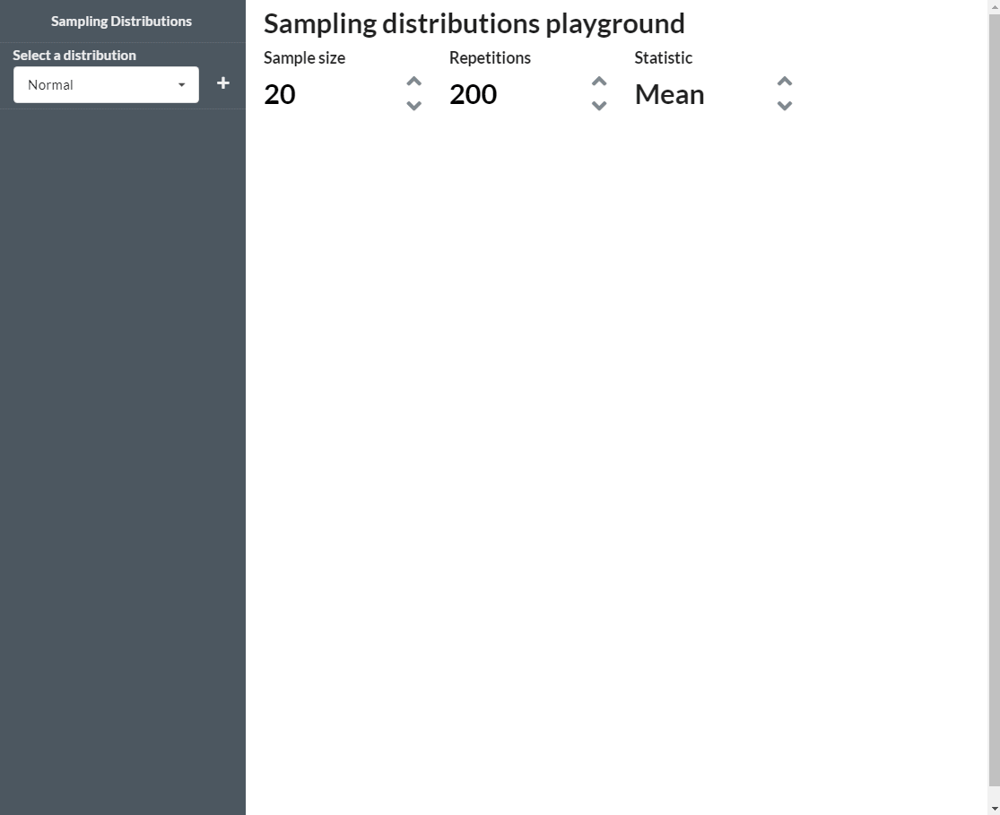

# samp

This package contains a Shiny app to visualize sampling distributions of several 
statistics. To install the package

```r
# install.packages("remotes")
remotes::install_github("tomicapretto/samp")
```

And you just run the app with

```r
samp::launch()
```

This is a simple demonstration of how you can use the app.




You can also see a live version of the app [here](https://tomicapretto.shinyapps.io/samp/).

## Basic usage

The objective of this application is to enable people to explore sampling
distributions of several statistics computed with samples coming from arbitrary
mixtures of probability distributions. 

### Add distributions to the mixture.

Choose one distribution at a time from the input on the left panel and click on **+**. 
This will add the distribution to the mixture and insert inputs to tune its 
parameters as well as the weight it has in the mixture. You can repeat this process 
as many times as you want, adding a new distribution to the mixture in each time.

### Tune sampling parameters

* **Sample size** is the number of draws we take from the (theoretical) mixture 
we construct. You can specify any integer number between 2 and 1000.
* **Repetitions** indicates how many times we repeat the sampling process. The larger
this number the better the approximation of the empirical sampling distribution. 
This must be between 10 and 1000.
* **Statistic** determines what statistic we compute with the sampled values. 
Currently, these are the available options:
  + Mean
  + Median
  + Minimum
  + Maximum
  + Percentile
* **Percentile** indicates which percentile we compute when we select Percentile option
in Statistic.

### Explore the charts

Just see the interactive charts and make up your conclusions!


## Final notes

* Weights must add up to 1. A notification appears every time weights add up to 
something different than 1.
* I would like to improve how the app handles weights. Ideally I would like to write
something that tunes the weights automatically so they sum 1 by default but allows
the user to choose other values. 
* Appart from better default weights, I don't think I will be adding many features 
to the app in the nearby feature.
* Want to contribute? Please do! I'm very open to any type of contribution 
(even if it is just a comment about something good/bad in the app).
